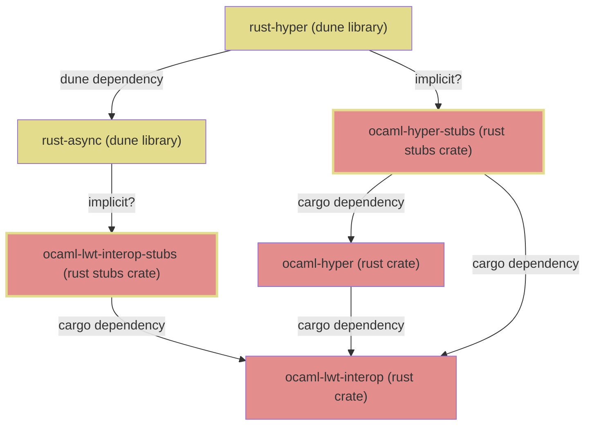
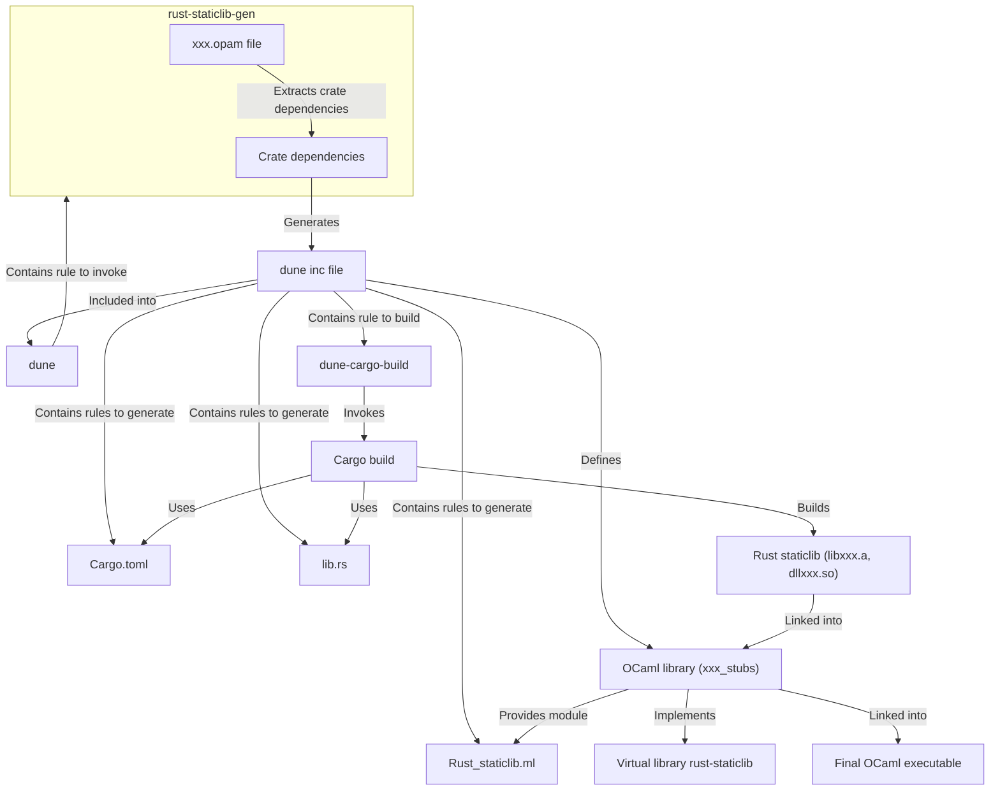

# rust-staticlib-gen

**rust-staticlib-gen** is a tool designed to streamline the integration of Rust
code into OCaml projects. It automates the generation of build files and
orchestrates the build process, allowing OCaml code to seamlessly interface with
Rust libraries. You can think of it as a "userspace" automation for Opam/Cargo
integration, `rust-staticlib-gen` suggest a workflow that is compatible with
stock Opam, Dune and Cargo and allows to unblock practical integration of Rust
libraries into OCaml projects for complex dependency hierarchies.

**WARNING**: This is still highly experimental, use at your own risk!

If you came here because of the error like the following one:

```
$ dune build
Error: No implementation found for virtual library "rust-staticlib-virtual"
in /home/user/git/my-project/lib
-> required by library "foo" in _build/default/lib
-> required by executable test in test/dune:2
-> required by _build/default/test/test.exe
```

Jump straight to [Installation](#installation) and [Usage](#usage) to generate
Rust staticlib using this tool, and satisfy the linking of the executable.

## Table of Contents

* [rust-staticlib-gen](#rust-staticlib-gen)
   * [Table of Contents](#table-of-contents)
   * [Problem statement](#problem-statement)
      * [Prior discussions on this:](#prior-discussions-on-this)
   * [Opam metadata-level linkage to Cargo crates](#opam-metadata-level-linkage-to-cargo-crates)
   * [Rust "tainting" and scary linker errors](#rust-tainting-and-scary-linker-errors)
   * [Features](#features)
   * [Installation](#installation)
   * [Usage](#usage)
      * [Initial integration](#initial-integration)
      * [Updating Rust dependencies](#updating-rust-dependencies)
      * [Command-line options](#command-line-options)
      * [dune-cargo-build](#dune-cargo-build)
   * [How It Works](#how-it-works)
   * [Contributing](#contributing)
   * [License](#license)

## Problem statement

Integrating Rust components into OCaml libraries at scale presents significant
challenges due to differences in package management and build systems. The main
issue lies in effectively combining Opam (OCaml's package manager) and Cargo
(Rust's package manager) to ensure seamless integration without compromising
dependency resolution or build reproducibility.

Key challenges include:

* ABI Compatibility: Rust lacks a stable ABI, necessitating recompilation from
  source for each project, which conflicts with Opam's handling of precompiled
  libraries.
* Dependency Management: Opam resolves dependencies before builds, whereas Cargo
  does so during the build process. This can lead to conflicts if dependencies
  are not managed consistently.
* Sandboxing and Network Access: Opam restricts network access during builds,
  complicating Cargo's dependency fetching process.
* Build System Integration: Aligning Cargo with Dune (OCaml's build system) is
  complex, requiring both systems to recognize and manage each other's build
  artifacts.

A proposed solution involves compiling all Rust components from source within
the final project that links executables. This approach circumvents direct
management of Rust dependencies by relying on Opam packages that encapsulate
these dependencies, ensuring compatibility and consistency across the build
process.

### Prior discussions on this:

* https://github.com/zshipko/ocaml-rs/issues/139
* https://discuss.ocaml.org/t/cargo-opam-packaging-of-a-rust-ocaml-project/5743
* https://users.rust-lang.org/t/integrating-rust-crates-into-ocaml-package-management/99818

## Opam metadata-level linkage to Cargo crates

Libraries with bindings to certain Cargo crates start forming their own
dependency graph. One library with bindings may want to use already defined
bindings for some other Rust entities, provided by another library with
bindings. For example, there is
[ocaml-lwt-interop](https://github.com/Lupus/ocaml-lwt-interop), which provides
integration between the Rust async world and OCaml's LWT monadic concurrency
library. It offers some OCaml API which wraps some Rust entities. Some
hypothetical bindings to the `hyper` HTTP framework would be willing to leverage
some types defined by `ocaml-lwt-interop`, so that `ocaml-hyper` could build on
top of that infrastructure. This forms independent dependency graphs within the
opam and cargo realms, and there is still this implicit knowledge that certain
Cargo crates provide some `extern "C"` functions which are used by specific opam
packages with bindings.



To encode these implicit links between opam packages and cargo crates, we
leverage the fact that opam allows arbitrary metadata to be contained within
opam package definitions. `dune` allows you to come up with a template for the
generation of an opam package, which `ocaml-lwt-interop` is using by providing
`rust-async.opam.template` file with the following content:

```bash
# This extensions connects this opam package to its corresponding Rust stubs
# crate. An automated tool could traverse opam dependencies, find ones
# containing such extension fields and combine a full set of Rust crate
# dependencies for a given opam file.
x-rust-stubs-crate: "ocaml-lwt-interop"
```

This special `x-rust-stubs-crate` metadata allows declaring that a specific opam
package requires certain Cargo crates to be built and linked into the final
executable so that the required `extern "C"` functions are available during the
linking phase.

## Rust "tainting" and scary linker errors

We can't just have Rust bits compiled independently into `.a` libraries and
throw them into the linker at the end. Rust drags in its whole stdlib into each
`.a` file that it produces, and having multiple such `.a` libraries at the
linking phase results in sporadic linker errors regarding duplicates (especially
when link-time optimization is enabled in Rust).

So we have to build Rust bits only once into a single `.a` library that would
get linked into the final executable(s). We call it a "Rust static library", or
"Rust staticlib". It seems that Debian is using this strategy to distribute Rust
libraries - they actually distribute source code inside `*-rust` packages and
whenever some package needs to build a Rust executable - it uses installed
sources to build it completely in one go and have the executable linked (see
[Debian Rust packaging policy for more details](https://wiki.debian.org/Teams/RustPackaging/Policy)).

Having special metadata in opam files allows automating the creation of such a
Rust staticlib and ensures it's correct and includes all the required Cargo
crates to fulfill the symbols expected by OCaml binding packages.

Yet for the opam ecosystem, this comes with a downside that some library deep in
the dependency tree of your application, requiring Rust dependencies, will
expect certain `extern "C"` functions to be available at link time, and as you
don't know anything about Rust in your app - it will explode at linking your
executable with scary-looking linker errors complaining about missing symbols,
and having special metadata inside opam packages alone does not help here.

To alleviate the unfriendly way of complaining about missing Rust dependencies,
we leverage dune virtual libraries. A well-known virtual library `rust-staticlib`
should be required by dune libraries, which depend on Rust bits, and the
generated Rust staticlib will implement this library. In this case, linker
errors will be avoided, dune will complain about missing virtual library
implementation, and while looking for how to satisfy this dependency, users
should reach out to the `rust-staticlib-gen` tool, which will provide this
virtual library within their project. Still far from ideal, but better than
leaving the users with linker errors that they will unlikely resolve on their
own at all.

Rust dependencies still will "taint" the entire dependency tree up to the final
executable (and including some test runner executables along the way), but this
looks like the best way forward so far.

## Features

`rust-staticlib-gen` currently is offering the following features:

- **Automatic Dependency Extraction**: Reads opam files to extract Rust crate
  dependencies specified via the `x-rust-stubs-crate` metadata field.
- **Build File Generation**: Generates necessary `dune` and `Cargo.toml` files
  for building Rust static libraries. Generated files have some comments to
  allow the reader to understand what they are doing and why.
- **Seamless Integration**: Orchestrates the build steps to integrate Rust code
  into OCaml projects without manual intervention, except for initial Rust
  project configuration.
- **Version Compatibility**: Ensures compatibility between OCaml bindings and
  Rust crates by specifying exact versions in `Cargo.toml`.

## Installation

This package is published onto opam repository. To install `rust-staticlib-gen`,
you can use `opam`:

```bash
opam install rust-staticlib-gen
```

This will also install `rust-staticlib-virtual` and `dune-cargo-build`, which
are required to use the generated Rust staticlib library.

## Usage

### Initial integration

`rust-staticlib-gen` should be used in projects that produce executables, which
require Rust stubs to be linked in. That could be the actual application
binaries, or some test binaries.

Create a directory for your Rust staticlib:

```
mkdir rust-staticlib
```

One should typically have the following dune file (place it in
`rust-staticlib/dune`) to generate the Rust staticlib (make sure to adjust
`../foo-bar.opam` to be your actual opam file):

```lisp
(include dune.inc)

(rule
 (deps ../foo-bar.opam (universe))
 (target dune.inc.gen)
 (action
  (run rust-staticlib-gen -o %{target} %{deps})))

(rule
 (alias runtest)
 (action
  (diff dune.inc dune.inc.gen)))
```

Dune will complain about missing `dune.inc`, so it should also be created as an
empty file:

```
touch rust-staticlib/dune.inc
```

Then populate the rules for staticlib:

```
$ dune runtest --auto-promote rust-staticlib
(... bunch of dune rules ...)
Promoting _build/default/rust-staticlib/dune.inc.gen to
  rust-staticlib/dune.inc.
```

If you see the error like this one:

```
[ERROR] Opam file (/home/username/git/your-project/_build/default/foo-bar.opam) defines local crate ocaml-foo-bar, you need to provide a relative path to this crate via --local-crate-path
```

Then you need to update your `rust-staticlib/dune` as follows:

```lisp
(rule
 (deps ../foo-bar.opam (universe))
 (target dune.inc.gen)
 (action
  (run rust-staticlib-gen
    --local-crate-path=..  ; <<<< This should be relative path from this folder
                           ; to directory which contains your ocaml-foo-bar
                           ; crate, assuming it's defined in the root of your
                           ; project, local crate path will be `..'
    -o %{target} %{deps})))
```

Whenever the set of dependncies gets changed, `dune runtest` needs to be re-run
to update the rules in `dune.inc`.

Running `dune build` should generate the Cargo.toml and lib.rs for the staticlib
crate and attempt to build it:

```
$ dune build rust-staticlib
Temporarily changing current dir to /home/username/git/your-project/rust-staticlib
Test connection to crates.io worked, assuming online mode for cargo
Running cargo build command: cargo build --manifest-path ./Cargo.toml --message-format json 
Returning back to /home/username/git/your-project/_build/default/rust-staticlib
Copied /home/username/git/your-project/target/debug/librust_staticlib_foo_bar.a to /home/username/git/your-project/_build/default/rust-staticlib/librust_staticlib_foo_bar.a
Copied /home/username/git/your-project/target/debug/librust_staticlib_foo_bar.so to /home/username/git/your-project/_build/default/rust-staticlib/dllrust_staticlib_foo_bar.so
   Compiling libc v0.2.150
   <....>
   Compiling rust-staticlib-foo-ber v0.1.0 (/home/username/git/your-project/rust-staticlib)
    Finished `dev` profile [unoptimized + debuginfo] target(s) in 10.05s
```

If connectivity to crates.io does not work, an offline build will be attempted
(`dune-cargo-build` passes `--offline` flag to `cargo build` in this case to be
compatible with with opam sandboxing). Your CI environment needs to ensure that
it runs `cargo fetch` so that Cargo downloads the dependencies, or use `cargo
vendor` so that your repository is self-contained and needs no internet access.

Once `dune build` succeeds for `rust-staticlib` directory, there will be
`foo_bar_stubs` library built by `dune`. This library will link in Rust
staticlib into your final executable, so make sure you specify it in
`(libraries ...)` section in your `(executable ...)` stanzas.

#### Additional crates for staticlib

If you have more local Rust crates with stubs that you want to include in your
staticlib, you can do that with `--extra-crate-path` option (can be passed multiple
times). This can be useful if you have some project with Rust bindings, where you
have single "production" crate that defines stubs for your OCaml library, but to
test it you need some additional Rust stubs for your test code too that you don't
want to include into "production" crate (test crate can have more dependencies
unnecessary otherwise, etc). The below dune file example shows how you can use that
in practice:

```
(rule
 (deps ../foo-bar.opam (universe))
 (target dune.inc.gen)
 (action
  (run
   rust-staticlib-gen
   --local-crate-path=..
   --extra-crate-path=../test
   -o
   %{target}
   %{deps})))
```

#### Specify dependencies in your project

You need to add the dependencies for your project, below is an example on how to do
that in `dune-project` file, adopting this to plain .opam is trivial:

```
(package
 (name foo-bar)
 (synopsis "Foo Bar")
 (depends
  (rust-staticlib-gen
   (and
    (>= 0.2.0)
    :with-test))
  (rust-staticlib-virtual
   (>= 0.2.0))
  (dune-cargo-build
   (and
    (>= 0.2.0)
    :build))))
```

If you're authoring new bindings - make sure that your Dune library that uses Rust
stubs depends on `rust-staticlib-virtual`, to ensure that users of your library will
see the error about virtual library implementation missing instead of linker errors
about missing Rust symbols.

### Updating Rust dependencies

As the Dune dependencies for `rust-staticlib-gen` includes `(universe)`, each
`dune runtest` will try to update the `dune.inc`, so once the new version of the
Opam package is installed into an Opam switch, running `dune runtest` should be
sufficient to start the process of updating the staticlib crate definition. As
in the above section, consecutive `dune build` should re-generate the staticlib
definitions and attempt to build it, and same caveat applies for missing Cargo
dependencies due to offline build.
Some desync is inevitable as Opam packages can be installed into Opam switch
without consecutive `dune runtest` command to regenerate the staticlib.  This
should be easily catched by CI though, as it will try to run the tests and there
will be diff between existing staticlib crate definition, and the correct one.
In worst case scenario, such desyncs can cause segmentation faults as external
function definitions will not match the actual functions linked into the final
executable.

### Command-line options

The following options ara available for `rust-staticlib-gen`:

- `--local-crate-path PATH`: Specify a relative path to a local Rust crate if
  your opam package defines a local crate.
- `--extra-crate-path PATH`: Specify a relative path to additional local Rust
  crate that should be included into the staticlib.
- `--output FILENAME`: Specify the output filename for the generated `dune` file.

**--local-crate-path**: This option is required when your opam package actually
implements bindings to some Rust library, and you have the `x-rust-stubs-crate`
metadata field set right in your opam file. This path should be a relative path
from the directory where `rust-staticlib-gen` is called to the directory
containing the `Cargo.toml` of your crate, configured in `x-rust-stubs-crate`.
This is required to emit a proper path dependency in the generated `Cargo.toml`
to your local crate. You would need to configure a Cargo workspace at the root
of your project and include both your local crate and the generated staticlib
crate as workspace members.

**--extra-crate-path**: This option is required when you have some additonal
crate in your project that you want to get linked into executables within your
project. For example, this crate can provide additional Rust stubs required for
your test binaries, and you might not want to drag those test stubs and their
additional dependencies into your main crate with stubs. This option can be
repeated multiple times.

### `dune-cargo-build`

While `dune-cargo-build` is the actual command used in Dune rules, generated by
`rust-staticlib-gen`, this tool is useful on its own, and can be used separately
like in this example:

```
(rule
 (targets stubs-gen)
 (deps
  stubs-gen.rs
  (alias %{workspace_root}/rust-staticlib/rust-universe))
 (locks cargo-build)
 (action
  (run dune-cargo-build stubs-gen)))
```

What it does: it runs `cargo build` in offline mode for the crate that was
provided as an argument (in the example above - `stubs-gen`). It tells Cargo to
emit JSON output, and parses it to figure out compiler artifacts. If artifacts
are .a/.so, `dune-cargo-build` copies them to current directory and renames them
to be compatible with what `(foreign_archives ...)` stanza expects
(`lib%s.a`/`dll%s.so`). If artifacts are executables, they are only copied to
current directory.

The main value in this tool is that it invokes cargo within the project source
directory, escaping the dune sandboxing. Running cargo within dune sandbox is
inefficient and error-prone, cargo is smart enough about it's build cache
hygiene, so no real reason to complicate matters here. Cargo provides absolute
paths to artifacts in its JSON output, which comes handy when copying them to
current directory, which is within dune sandbox.

### `rust-universe` alias within staticlib dir

`rust-staticlib-gen` rules include a convenient alias `rust-universe` which
depends on all Rust/Cargo sources/configs within the project. If you need to
re-built something whenever Rust/Cargo universe changes, feel free to depend on
this alias as in the above rule example in `dune-cargo-build` section.

## How It Works

`rust-staticlib-gen` automates the integration of Rust code into OCaml projects
by performing the following steps:

1. **Dependency Extraction**: Reads an opam file to extract Rust crate
   dependencies specified via the `x-rust-stubs-crate` metadata field (this
   involves scanning the transitive dependencies of the provided opam file).

2. **Generating Build Files**: Using the extracted dependencies, it generates a
   `dune.inc` file containing rules to produce `Cargo.toml`, `lib.rs`, and
   `Rust_staticlib.ml`.

3. **Building Rust Static Library**:
   - The `dune.inc` rules trigger `dune-cargo-build`, which invokes Cargo to
     build the Rust static library.
   - `Cargo.toml` and `lib.rs` are used in the Cargo build process to compile
     the Rust code into static and dynamic libraries.
   - The `dune-cargo-build` tool parses JSON output from the Cargo build to
     know which artifacts it produced and copies them to the current directory,
     also renaming them to match what OCaml expects for foreign stubs.
   - Important note: This whole pipeline relies on Cargo detecting the original
     project directory and effectively escaping dune sandboxing
     (`_build/default`). Cargo is perfectly capable of maintaining incremental
     builds and hygiene around its build cache, so it does not make much sense
     to try to squeeze Cargo into dune sandbox. `dune.inc` has rules to
     accurately track all Rust bits in the project, so that Cargo is called to
     rebuild the static library truly incrementally.
   - Important note #2: Cargo is run with the `--offline` flag, so one has to
     ensure that `cargo fetch` was called somewhere in the CI pipeline, or by
     hand before building the project locally. Offline mode is required to
     successfully build under the opam sandbox, where no network access is
     present. If calling `cargo fetch` is not feasible, one can use `cargo
     vendor` to bundle all Rust dependencies right into the source tree, making
     it self-contained and 100% offline compatible.

4. **Linking and Integration**:
   - The resulting Rust static library is linked into an OCaml library
     (`xxx_stubs`).
   - This OCaml library provides the `Rust_staticlib` module and implements the
     virtual library `rust-staticlib`.
   - The `xxx_stubs` library is then linked into the final executable, bringing
     all the (transitive) Rust dependencies required for successful linking. You
     should not use `xxx_stubs` outside of your project. The generated rules do
     not assign any public name to this library, so dune should prevent you from
     depending on this library in your public libraries - those should depend on
     the virtual library `rust-staticlib` if they need Rust bindings to be
     present, or depend on some other library, which itself depends on
     `rust-staticlib`.

**Diagram illustrating the build process:**



## Contributing

Contributions are welcome! Please open an issue or submit a pull request on
GitHub.


## License

This project is licensed under the Apache License Version 2.0. See the
[LICENSE](LICENSE) file for details.
